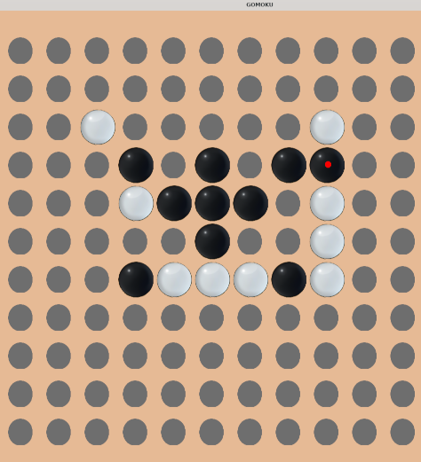

# Intro


Started as an Epitech project, here is my implementation of an AI playing Gomoku.
There are two versions: one with a graphical interface and one compliant with the subjet protocol found [**here**](https://svn.code.sf.net/p/piskvork/code/trunk/source/doc/protocl2en.htm "Piskvork Protocol").



## Gomoku game
Players alternate turns placing a stone of their color on an empty intersection. Black plays first. The winner is the first player to form an unbroken chain of five stones horizontally, vertically, or diagonally. 

# Usage and install
## Graphical 

The make file for the graphical version is at the root (need the SFML library):

```
make 
./gomoku-ai-graph
```

#### Simple and Fast Multimedia Library (SFML )
`sudo apt-get install libsfml-dev`
OR
`sudo dnf install SFML.x86_64 `
## Protocol compliant binary
The makefile for this one is in gomoku :
```
cd gomoku
make
./pbrain-gomoku-ai
```

### Command 
- START [size] : must be greater than 5
- TURN [X],[Y]  : opponent move -> return ai's move
- BEGIN : first to play -> return ai's move
- BOARD :
	-  get  continually feed info on the board, in this format :
	-  x, y, ID 
	-  ID = 1 for AI 
	- ID = 2 for opponent 
	- until  'DONE' is received
- END : end game 
- PRINT : print board
- RESTART: restart game
- ABOUT : basic info